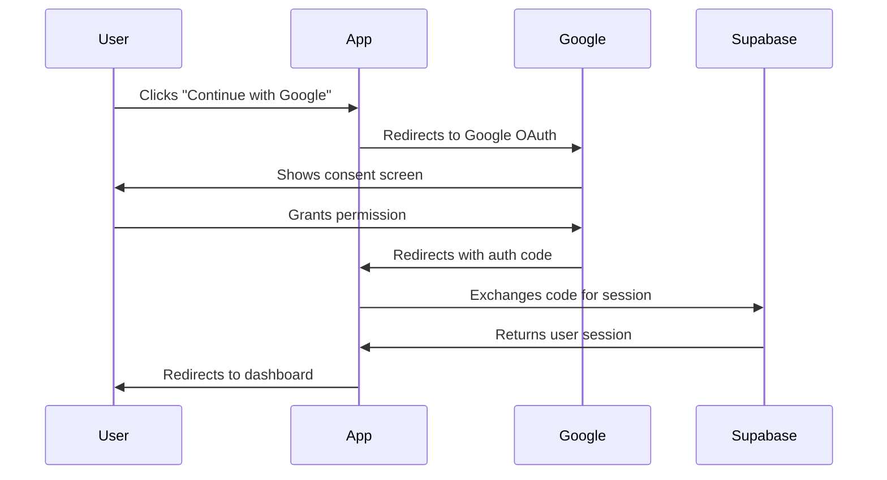

# Google OAuth Setup Guide

This guide explains how to configure Google OAuth authentication for Yi Connect.

## Overview

Yi Connect now supports Google OAuth authentication, allowing users to sign in with their Google accounts. The implementation includes:

- ✅ Google OAuth button on login and signup pages
- ✅ OAuth callback handler
- ✅ Automatic profile creation for new users
- ✅ Seamless integration with existing auth flow

## Files Created/Modified

### New Files:
1. `components/auth/oauth-buttons.tsx` - Google OAuth button component
2. `app/auth/callback/route.ts` - OAuth callback route handler
3. `docs/GOOGLE_OAUTH_SETUP.md` - This documentation

### Modified Files:
1. `components/auth/login-form.tsx` - Added Google OAuth button
2. `components/auth/signup-form.tsx` - Added Google OAuth button

## Setup Instructions

### Step 1: Create Google OAuth Credentials

1. Go to [Google Cloud Console](https://console.cloud.google.com/)
2. Create a new project or select an existing one
3. Enable the **Google+ API**
4. Go to **Credentials** → **Create Credentials** → **OAuth 2.0 Client ID**
5. Configure OAuth consent screen:
   - User Type: External
   - App name: Yi Connect
   - User support email: your-email@example.com
   - Developer contact: your-email@example.com
   - Scopes: email, profile, openid
6. Create OAuth 2.0 Client ID:
   - Application type: Web application
   - Name: Yi Connect Production
   - Authorized JavaScript origins:
     - `http://localhost:3000` (for development)
     - `https://your-production-domain.com` (for production)
   - Authorized redirect URIs:
     - `http://localhost:3000/auth/callback` (for development)
     - `https://your-production-domain.com/auth/callback` (for production)
     - Add your Supabase project URL: `https://YOUR_PROJECT_REF.supabase.co/auth/v1/callback`

7. Copy the **Client ID** and **Client Secret**

### Step 2: Configure Supabase

1. Go to your [Supabase Dashboard](https://app.supabase.com/)
2. Select your project
3. Navigate to **Authentication** → **Providers**
4. Find **Google** in the provider list
5. Enable Google provider
6. Paste your Google OAuth credentials:
   - **Client ID**: From Step 1
   - **Client Secret**: From Step 1
7. Configure redirect URLs (should auto-populate):
   - Callback URL: `https://YOUR_PROJECT_REF.supabase.co/auth/v1/callback`
8. Save changes

### Step 3: Update Environment Variables

No additional environment variables are needed! The implementation uses existing Supabase configuration:
- `NEXT_PUBLIC_SUPABASE_URL` (already configured)
- `NEXT_PUBLIC_SUPABASE_ANON_KEY` (already configured)

### Step 4: Test the Integration

1. Start your development server:
   ```bash
   npm run dev
   ```

2. Navigate to the login page: `http://localhost:3000/login`

3. Click **"Continue with Google"** button

4. You should be redirected to Google's consent screen

5. After authorizing, you'll be redirected back to your app and logged in

6. Check that:
   - User is created in `auth.users` table
   - Identity is created in `auth.identities` table (provider='google')
   - Profile is auto-created in `public.profiles` table

## How It Works

### Authentication Flow



### Database Integration

When a user signs in with Google:

1. **auth.users** table:
   - New user created with `is_sso_user = true`
   - `raw_user_meta_data` contains Google profile info

2. **auth.identities** table:
   - Identity created with `provider = 'google'`
   - `identity_data` contains Google user info

3. **public.profiles** table:
   - Profile automatically created via database trigger
   - Extracts `full_name`, `email`, and `avatar_url` from Google data

## Components

### OAuthButtons Component

Location: `components/auth/oauth-buttons.tsx`

**Features:**
- Google branding with official logo colors
- Loading states during authentication
- Error handling with user-friendly messages
- Responsive design

**Usage:**
```tsx
import { OAuthButtons } from '@/components/auth/oauth-buttons'

<OAuthButtons />
```

### OAuth Callback Handler

Location: `app/auth/callback/route.ts`

**Purpose:**
- Handles OAuth redirect from Google
- Exchanges authorization code for session
- Redirects to dashboard on success
- Handles errors gracefully

## Security Considerations

✅ **Implemented:**
- Uses Supabase Auth (industry-standard OAuth 2.0)
- HTTPS-only in production
- PKCE flow for security
- Automatic session management
- Cookie-based authentication

✅ **Best Practices:**
- Client ID and Secret stored securely in Supabase
- No sensitive credentials in code
- Redirect URLs whitelist configured
- User consent required for data access

## Troubleshooting

### Issue: "OAuth provider not configured"
**Solution:** Ensure Google provider is enabled in Supabase Dashboard → Authentication → Providers

### Issue: "Redirect URI mismatch"
**Solution:** Verify redirect URIs match exactly in both Google Console and Supabase:
- Google Console: `https://YOUR_PROJECT_REF.supabase.co/auth/v1/callback`
- App callback: `http://localhost:3000/auth/callback`

### Issue: "User is created but no profile"
**Solution:** Check database trigger `on_auth_user_created` exists and is enabled

### Issue: "Google button doesn't work"
**Solution:**
1. Check browser console for errors
2. Verify `NEXT_PUBLIC_SUPABASE_URL` and `NEXT_PUBLIC_SUPABASE_ANON_KEY` are set
3. Test Supabase connection manually

## Testing Checklist

- [ ] Google OAuth button appears on login page
- [ ] Google OAuth button appears on signup page
- [ ] Clicking button redirects to Google
- [ ] After consent, redirects back to app
- [ ] User is logged in successfully
- [ ] User entry created in auth.users
- [ ] Identity created in auth.identities
- [ ] Profile created in public.profiles
- [ ] Email/password login still works
- [ ] Signup with email still works

## Additional OAuth Providers

To add more providers (GitHub, Facebook, etc.), follow the same pattern:

1. Add provider button to `components/auth/oauth-buttons.tsx`
2. Configure provider in Supabase Dashboard
3. Update callback handler if needed
4. Test the flow

Example for GitHub:
```tsx
await supabase.auth.signInWithOAuth({
  provider: 'github',
  options: {
    redirectTo: `${window.location.origin}/auth/callback`,
  },
});
```

## Support

For issues or questions:
1. Check Supabase Auth logs in Dashboard
2. Review browser console errors
3. Verify Google OAuth settings in Google Cloud Console
4. Check database trigger for profile creation

## References

- [Supabase Auth Documentation](https://supabase.com/docs/guides/auth)
- [Google OAuth 2.0 Documentation](https://developers.google.com/identity/protocols/oauth2)
- [Next.js Authentication Best Practices](https://nextjs.org/docs/authentication)
